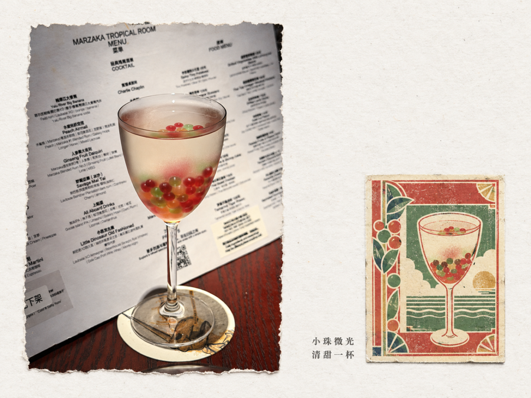
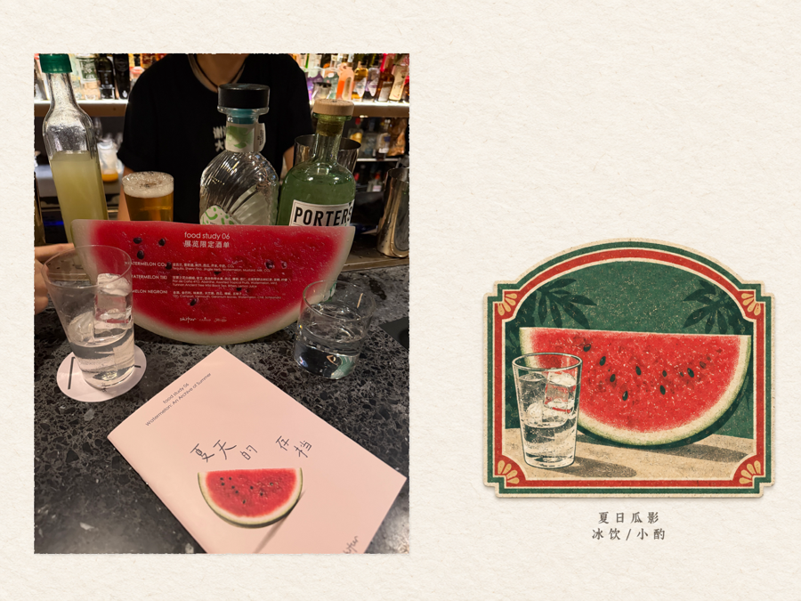
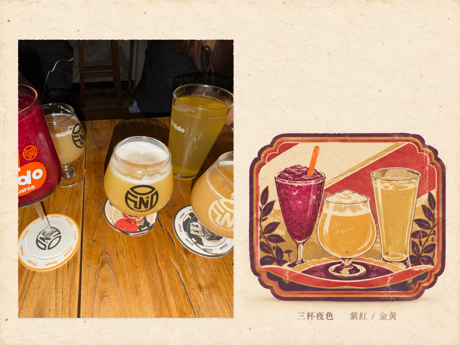
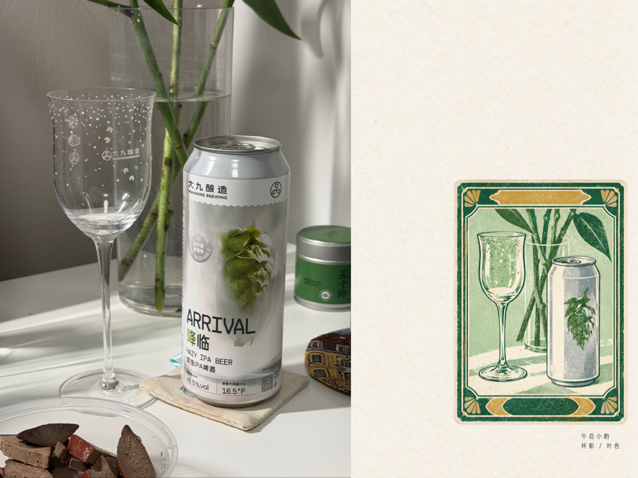

# Daily Photo to Retro Label

一个 Codex skill：把用户上传的日常照片整理成横版档案纸作品，并将照片中的主体转译为小型、无字、有限色套印的中式复古酒标。

## 视觉结果

- 1536 × 1152 px、4:3 横构图
- 左侧为忠实保留的真实照片，使用自然撕边
- 右侧为暖白档案纸、大面积留白和角落酒签组
- 酒标内部不使用文字，以边框、色带、景观窗和装饰纹样保留老酒标的设计层次
- 酒标外使用小号、褪色的中文打字机文字

## 示例

<table>
  <tr>
    <th>小珠微光 · 彩珠高脚杯</th>
    <th>夏日瓜影 · 西瓜酒单</th>
  </tr>
  <tr>
    <td></td>
    <td></td>
  </tr>
  <tr>
    <th>三杯夜色 · 多杯组合</th>
    <th>午后杯影 · 器物与植物</th>
  </tr>
  <tr>
    <td></td>
    <td></td>
  </tr>
</table>

## 安装

将整个仓库复制到 Codex skills 目录：

```bash
git clone https://github.com/liaoleyan11liaoleyan-bot/daily-photo-to-retro-label.git
cp -R daily-photo-to-retro-label ~/.codex/skills/
```

重新启动 Codex 或开启新任务，使 skill 被重新发现。

## 使用

上传一张日常照片，并要求使用 `daily-photo-to-retro-label`。为了得到更明确的老酒标风格，建议同时上传一至数张具有明确边框、色带、版面分区和有限色套印特征的中式老酒标参考图。

示例：

> 使用 daily-photo-to-retro-label，把这张照片制作成横版档案纸作品。酒标不含文字，外部文字写“小珠微光 / 清甜一杯”。

详细规则见 [SKILL.md](SKILL.md)。

## 参考图片

本仓库当前不附带第三方酒标图片。请使用自己拥有发布和使用权限的参考素材；参考图只用于提取版式、边框、色块和印刷语言，不复制品牌、厂名、商标或其他识别信息。
